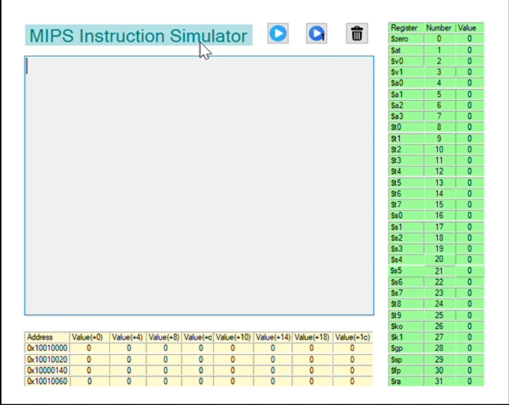

# mips-simulator-c++
**Step 1:** **Create a Project**
- Open **Visual Studio**

- Click "Create a new project".
- Search for "CLR Empty Project (.NET Framework)".
- Select it and click Next.
- Give your project a name (e.g., "MIPS_Simulator") and choose a save location.
Click Create.

**Step 2: Add Necessary Files** 
- Right-click on the Source Files folder in Solution Explorer.
- Select "Add" > "New Item".
- Choose C++ File (.cpp) and name it mips_code.cpp, 
then click Add.
- Repeat the process and create another file: MyForm.cpp
- Now Right-click on the Header Files folder in Solution Explorer.
- Choose header File (.h) and name it Myform.h, 
then click Add.

Now, you should have:
mips_code.cpp (for MIPS simulation logic)
MyForm.h (for GUI)
Myform.cpp (the main entry file)

**Step 3: Add Code to Files**

- mips_code.cpp (MIPS Simulator Logic)
Copy and paste all MIPS simulator code into mips_code.cpp.

- MyForm.h (GUI Code)
Copy the Windows Forms GUI code into MyForm.h.

- Modify MIPS_Simulator.cpp (Main Entry)
Open MIPS_Simulator.cpp and replace everything with:

**Step 4: Enable CLR Support**
- Since this project uses Windows Forms, you need Common Language Runtime (CLR) support:

- Right-click on your project in Solution Explorer.
Click "**Properties**".

Under "**Configuration Properties" → "General", set:
Common Language Runtime Support → /clr**
Click Apply and OK.

**Step 5: Build and Run**

- Click "Build" → "Build Solution" (Ctrl + Shift + B).

For demo click on the given link: https://youtu.be/Q4pLFmr3Fy4
